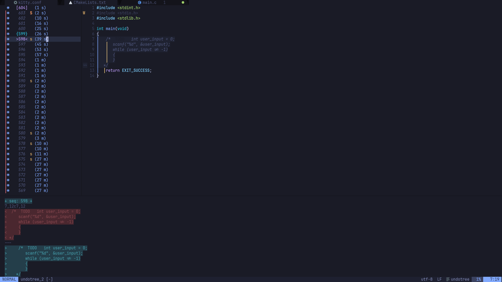
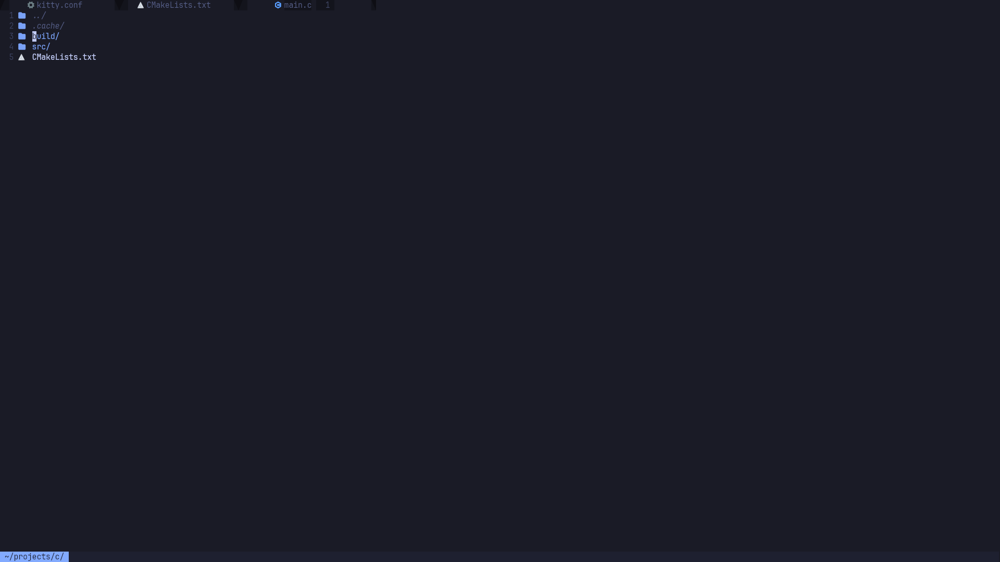

# 🔥 Bare Metal C - Neovim Configuration

Professional Neovim configuration optimized for **C/C++ development** with beautiful UI and smooth animations.

> Forked from [Magicalbat/Configs](https://github.com/Magicalbat/Configs) and enhanced with 40+ plugins.

## 📸 Screenshots

### Undotree & Diff View


### File Explorer


## ✨ Features

- **LSP**: Native Neovim 0.11+ LSP with clangd (optimized flags)
- **Completion**: nvim-cmp with LuaSnip snippets
- **Treesitter**: Advanced syntax highlighting
- **Dashboard**: Custom Bare Metal theme with gold-orange gradient
- **Animations**: Smooth 60 FPS animations (mini.animate)
- **Notifications**: Beautiful fade-in/slide-out notifications
- **UI**: Centered cmdline, rounded borders, custom icons (noice.nvim)

## 🚀 C/C++ Snippets

Complete preprocessor directive snippets:

| Snippet | Output |
|---------|--------|
| `#include` | `#include <header>` |
| `#define` | `#define NAME value` |
| `#ifdef` | `#ifdef MACRO ... #endif` |
| `#ifndef` | `#ifndef MACRO ... #endif` |
| `guard` | Complete header guard |
| `#externc` | Extern C block for C++ |
| `main` | Main function template |

## ⌨️ Key Bindings

| Key | Action |
|-----|--------|
| `<leader>xx` | Trouble diagnostics |
| `<leader>sr` | Search & Replace (Spectre) |
| `<leader>u` | Undotree |
| `<leader>ng` | Generate docs (Neogen) |
| `]]` / `[[` | Next/prev reference (Illuminate) |
| `]q` / `[q` | Next/prev quickfix |
| `]d` / `[d` | Next/prev diagnostic |

## 📦 Installation

```bash
# Backup existing config
mv ~/.config/nvim ~/.config/nvim.bak

# Clone this repo
git clone https://github.com/CompileRider/Configs.git
ln -s ~/Configs/nvim ~/.config/nvim

# Start Neovim (plugins install automatically)
nvim
```

## ⚙️ Requirements

- Neovim 0.11+
- clangd (for C/C++ LSP)
- ripgrep (for Telescope/Spectre)
- A Nerd Font (for icons)

## 📄 License

MIT
