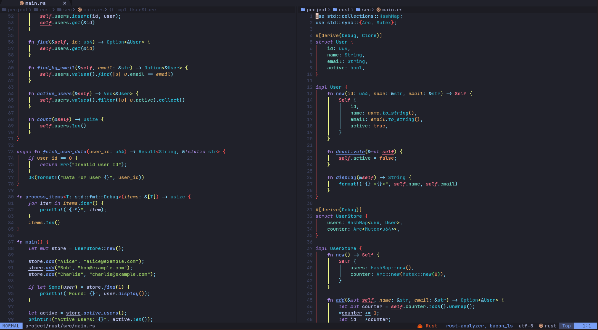
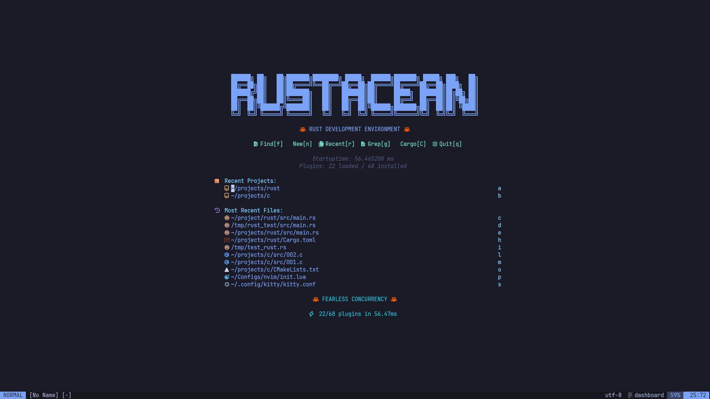
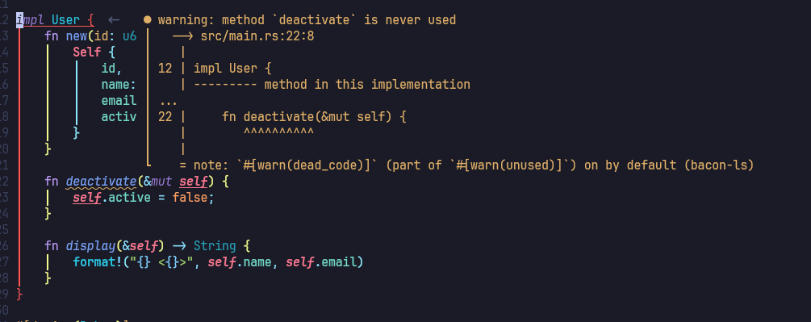

# 🦀 Rustacean - Neovim Configuration

Professional Neovim configuration optimized for **Rust development** with beautiful UI and smooth animations.

> Forked from [Magicalbat/Configs](https://github.com/Magicalbat/Configs) and enhanced with 50+ plugins.

## 📸 Screenshots

### Code Editing with Semantic Highlighting


### Inline Diagnostics


### Expanded Inline Diagnostics


### Discord Rich Presence


## ✨ Features

- **LSP**: rustaceanvim + bacon-ls for fast diagnostics
- **Completion**: nvim-cmp with full rust-analyzer features
- **Diagnostics**: Beautiful inline diagnostics (tiny-inline-diagnostic)
- **Cargo.toml**: crates.nvim with animated loading spinner
- **Treesitter**: Advanced syntax highlighting for Rust
- **Semantic Tokens**: Custom colors for lifetimes, unsafe, mut, async
- **Rainbow**: Colored brackets and indent guides
- **Breadcrumbs**: Winbar showing code context (dropbar)
- **Animations**: Smooth 60 FPS animations (mini.animate)
- **UI**: Centered cmdline, rounded borders, custom icons (noice.nvim)

## 🦀 Rust Features

| Feature | Description |
|---------|-------------|
| Inlay Hints | Types, lifetimes, parameter names |
| Code Actions | Quick fixes, refactoring |
| Hover | Documentation, memory layout |
| Code Lens | Run/Debug buttons inline |
| Expand Macro | See macro expansion |
| Runnables | Run tests/examples from editor |

## ⌨️ Key Bindings

### Rust/Cargo
| Key | Action |
|-----|--------|
| `<leader>Cr` | Cargo run |
| `<leader>Cb` | Cargo build |
| `<leader>Ct` | Cargo test |
| `<leader>Cc` | Cargo clippy |
| `<leader>rr` | Runnables |
| `<leader>rt` | Testables |
| `<leader>rm` | Expand macro |
| `<leader>re` | Explain error |

### Crates.nvim (Cargo.toml)
| Key | Action |
|-----|--------|
| `<leader>cv` | Show versions |
| `<leader>cf` | Show features |
| `<leader>cu` | Upgrade crate |
| `K` | Crate info popup |

### General
| Key | Action |
|-----|--------|
| `<leader>xx` | Trouble diagnostics |
| `<leader>sr` | Search & Replace |
| `<leader>u` | Undotree |
| `<leader>ng` | Generate rustdoc |
| `<leader>b` | Toggle breakpoint |
| `<F5>` | Debug continue |

## 📦 Installation

```bash
# Backup existing config
mv ~/.config/nvim ~/.config/nvim.bak

# Clone this repo
git clone https://github.com/CompileRider/nvim-config.git ~/Configs/nvim
ln -s ~/Configs/nvim ~/.config/nvim

# Start Neovim (plugins install automatically)
nvim
```

## ⚙️ Requirements

- Neovim 0.11+
- rust-analyzer
- rustfmt
- taplo (TOML formatter)
- codelldb (for debugging)
- ripgrep (for Telescope)
- A Nerd Font (for icons)

### Optional
- bacon + bacon-ls (fast background diagnostics)
- cargo-nextest (better test runner)
- sccache (compilation cache)

## 🎨 Semantic Highlighting

Custom colors for Rust-specific tokens:

| Token | Style |
|-------|-------|
| Lifetimes | Purple italic |
| `self` | Red bold |
| `unsafe` | Red bold |
| Macros | Cyan bold |
| Mutable | Underlined |
| Async | Italic |
| Attributes | Orange |

## 📄 License

MIT
